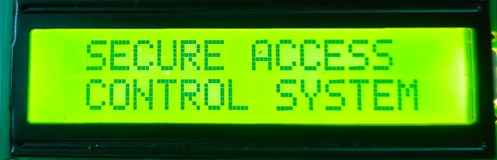
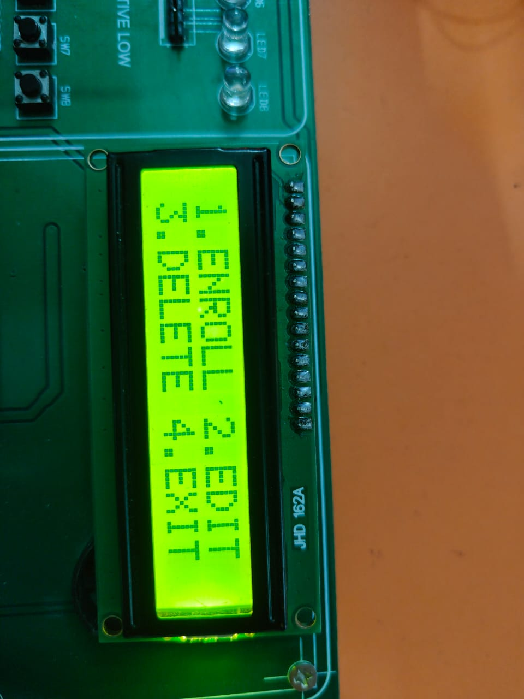
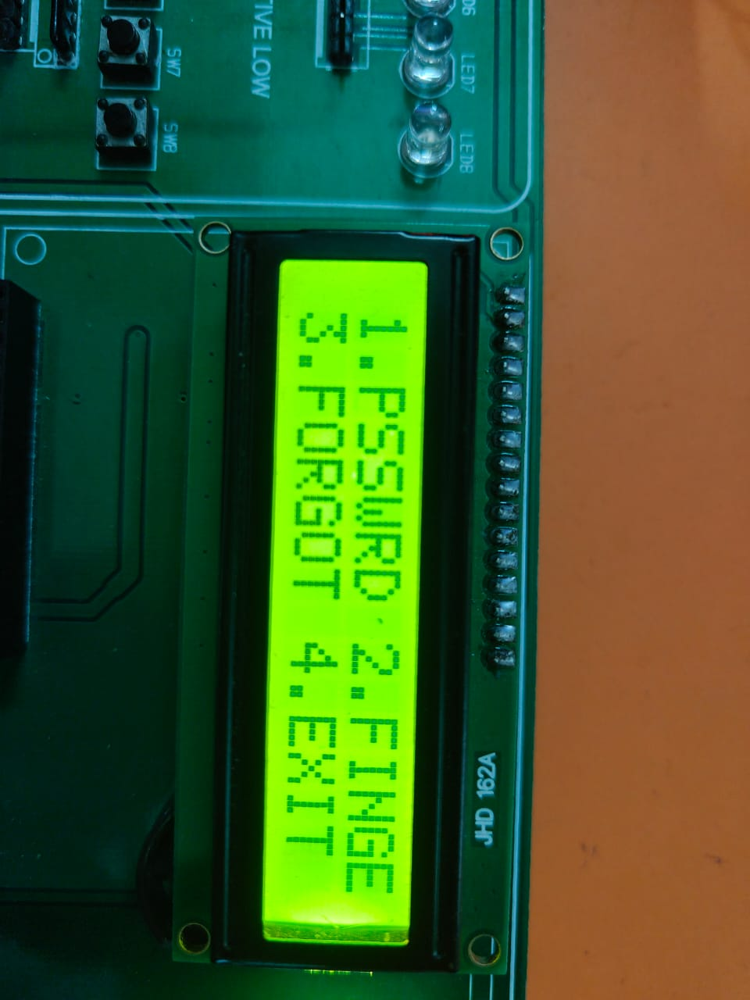
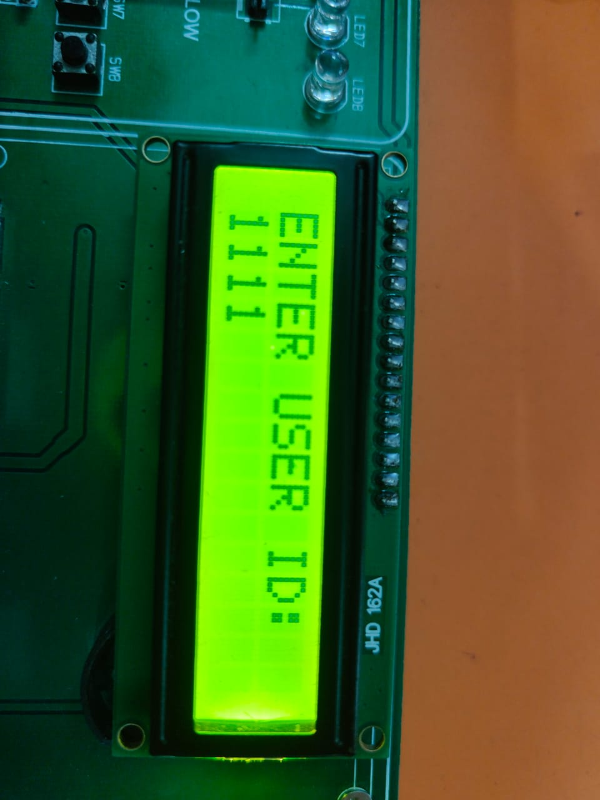
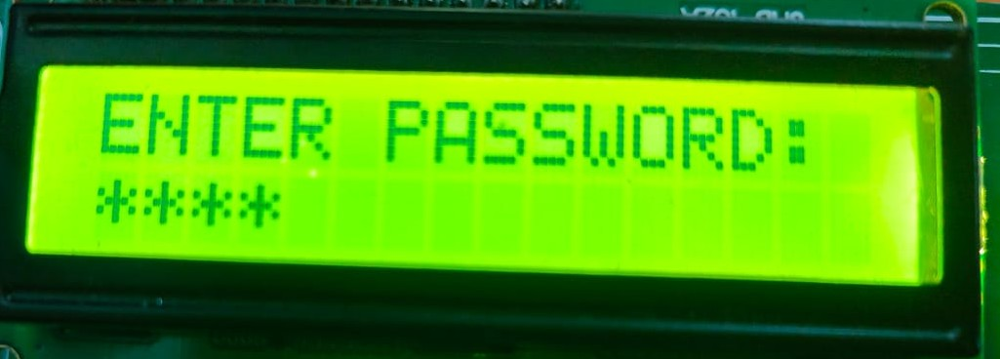
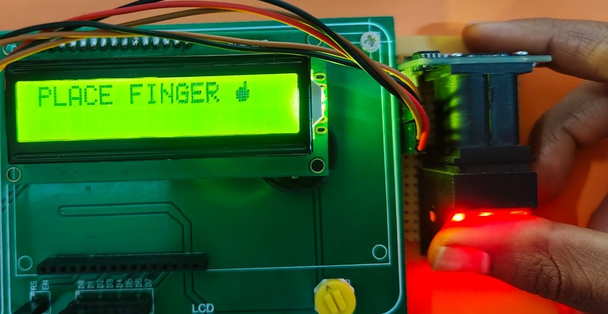
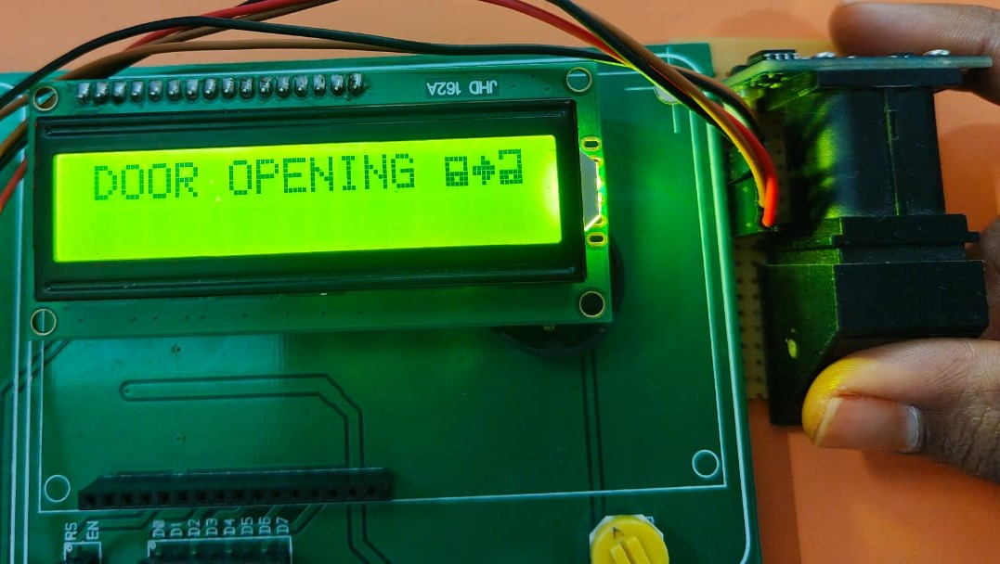
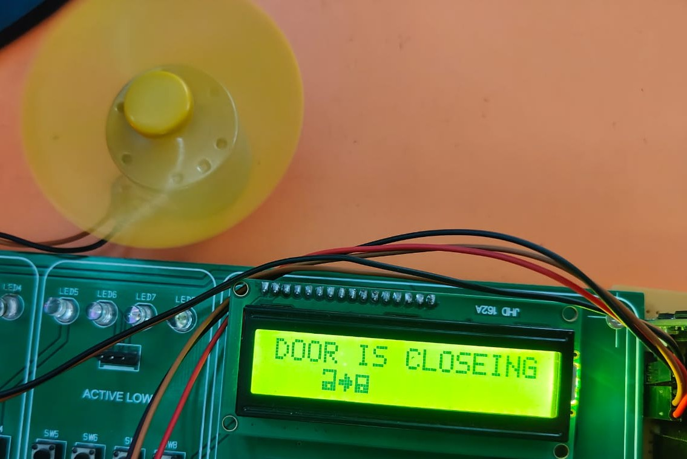

# Secure Access Control System with Multi-Level Authentication

## 📌 Project Overview

The **Secure Access Control System with Multi-Level Authentication** is an embedded security system developed using the **LPC2148 ARM7 microcontroller**. The system provides multiple levels of authentication to ensure that only authorized users can access the secured system.

The authentication process combines **User ID, Password, and Fingerprint verification**. User credentials are stored in **EEPROM**, allowing the information to be retained even after the system is powered off.

---

## 🎯 Objective

The main objective of this project is to design and implement a reliable access-control system using multiple authentication techniques.

The system aims to:

* Provide multi-level user authentication.
* Verify users using an ID and password.
* Authenticate users using a fingerprint sensor.
* Store user credentials permanently using EEPROM.
* Provide a user-friendly interface using an LCD and keypad.
* Control access to the system based on successful authentication.

---

## 🔐 Block Diagram

The system follows a three-level authentication procedure:

---

## ⚙️ Key Features

* **Three-level authentication**

  * User ID
  * Password
  * Fingerprint

* **EEPROM-based data storage**

  * Stores user IDs and passwords.
  * Retains data even after power is removed.

* **Fingerprint authentication**

  * Uses the R305 fingerprint sensor.

* **Keypad input**

  * Used for entering IDs, passwords, and menu selections.

* **LCD display**

  * Displays prompts, authentication status, and system messages.

* **LPC2148 ARM7 microcontroller**

  * Controls the complete authentication and access-control process.

* **Motor control**

  * Uses an L293D motor driver to control the DC motor.

---

## 🧰 Hardware Requirements

* LPC2148 ARM7 Microcontroller
* 16×2 LCD
* 4×4 Matrix Keypad
* R305 Fingerprint Sensor
* EEPROM
* L293D Motor Driver
* DC Motor
* Switches
* USB-to-UART Converter
* Power Supply

---

## 💻 Software Requirements

* Embedded C
* Keil µVision
* Flash Magic

---

## 🔌 Main Components and Their Functions

| Component  | Function                                            |
| ---------- | --------------------------------------------------- |
| LPC2148    | Main microcontroller that controls the system       |
| LCD        | Displays system messages and user prompts           |
| 4×4 Keypad | Allows the user to enter ID, password, and commands |
| R305       | Performs fingerprint authentication                 |
| EEPROM     | Stores user IDs and passwords                       |
| L293D      | Drives the DC motor                                 |
| DC Motor   | Represents the controlled access mechanism          |
| Switches   | Used for system control and interrupt functions     |

---

## 🧠 Working Principle

1. The system initializes the LPC2148 microcontroller and connected peripherals.
2. User Enrolls the fingerprint by giving an interrupt.
3. The user enters an ID using the keypad.
4. The entered ID is compared with the IDs stored in EEPROM.
5. If the ID is valid, the system requests the corresponding password.
6. The entered password is verified against the stored password.
7. If the password is correct, fingerprint authentication is initiated.
8. The R305 fingerprint module verifies the user's fingerprint.
9. If all authentication levels are successful, access is granted.
10. The L293D motor driver controls the DC motor for the access mechanism.
11. If any authentication step fails, access is denied.

---

## 💾 EEPROM Usage

EEPROM is used to store user information such as:

* User IDs
* User passwords
* Other required user data

The major advantage of EEPROM is **non-volatile storage**. The stored information remains available even when the power supply is removed.

This allows previously stored user credentials to be used when the system is powered on again.

## 🛠️ Development Tools

**Microcontroller:** LPC2148 ARM7
**Programming Language:** Embedded C
**IDE:** Keil µVision
**Programming Tool:** Flash Magic
**Communication:** UART / I²C

---
## 📸 Project Demonstration

The following images show the different stages of the authentication and access-control process.
### 1. Title

### 2. Main Menu

### 3. Edit Menu

### 4. Enter UserID

### 5. Password Verification

### 6. Fingerprint Verification

### 7. Access Granted(Door open)

### 8. Door Close

## 🎥 Project Demonstration

The complete working demonstration of the Secure Access Control System is available below:

[▶️ Watch Project Demonstration](Video/project_demonstration.mp4)

## 🚀 Applications

The concepts implemented in this project can be applied to:

* Secure door access systems
* Restricted-area access control
* Employee authentication systems
* Laboratory security systems
* Office access systems
* Automated security systems

---

## 🔮 Future Enhancements

The system can be further enhanced by adding:

* RFID-based authentication
* GSM-based notification
* IoT-based remote monitoring
* Mobile application integration
* Real-time access logs
* Web-based user management
* Additional biometric authentication methods

---

## 👩‍💻 Author

**Yashaswini Mettu**

B.Tech – Electronics and Communication Engineering

---

## ⭐ Project Highlights

**Embedded Systems | ARM7 | LPC2148 | Embedded C | Fingerprint Authentication | EEPROM | I²C | UART | Keypad | LCD | Motor Control**
